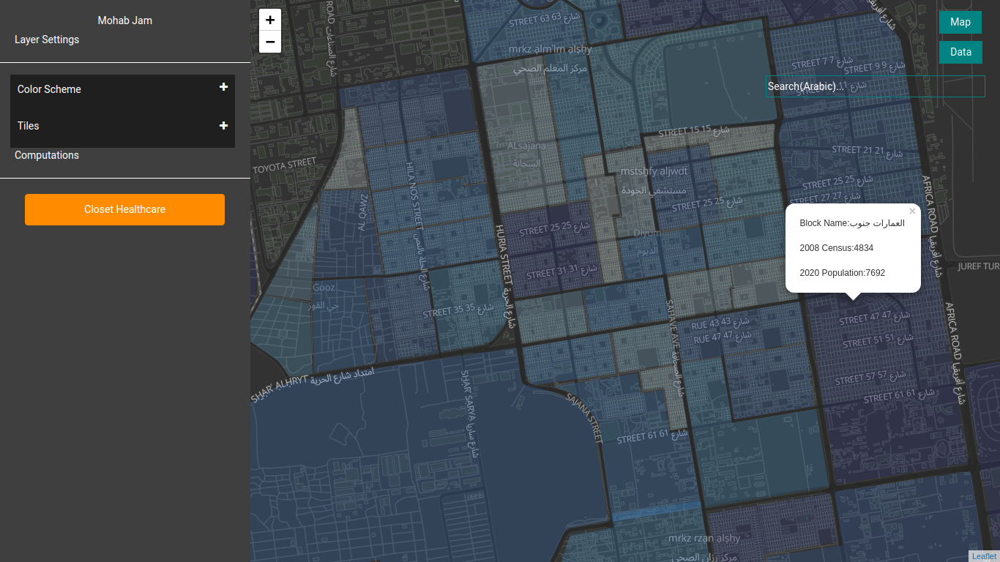

Web app illustrates the results of spatial analysis based on Accessibility and population density is conducted to construct a vulnerability area using vulnerability index for the primitive administration blocks of the state Khartoum.

